# 租户创建完整流程时序图

**文档版本**: v3.0
**最后更新**: 2025-10-18
**适用架构**: 平台菜单+角色管理架构 v3.0

---

## 📋 流程概述

本文档详细记录从创建租户开始到完成的整个流程，包括每一步的接口调用、类方法、数据库操作，方便问题排查和全流程测试。

### 核心流程

```
创建租户 → Schema初始化 → 创建管理员 → 自动同步模板(菜单+角色) → 租户可用
```

### 关键变更（v3.0）🆕

**新增功能**：
- ✅ 新增步骤：自动同步菜单和角色模板（SYNC_TEMPLATES）
- ✅ 根据租户 feature_level 自动筛选模板（基础版/标准版/企业版）
- ✅ 自动同步角色-菜单关联关系
- ✅ 避免手动分配，提升运维效率

### 关键变更（v2.0）

**与旧版本对比**：
- ❌ 旧版本：创建租户时自动插入菜单数据（tenant_init_data.sql）
- ✅ v2.0：创建租户时不插入菜单，需通过平台分配接口单独分配
- ✅ v3.0：创建租户时自动同步菜单和角色模板，无需手动分配

---

## 🔄 完整时序图（Mermaid）

```mermaid
sequenceDiagram
    participant Client as 客户端/管理员
    participant Gateway as API网关
    participant TenantCtrl as TenantController
    participant TenantSvc as TenantService
    participant SchemaInit as TenantSchemaService
    participant DB as PostgreSQL
    participant Redis as Redis缓存
    participant MenuAssign as TenantMenuAssignmentService

    %% ========================================
    %% 阶段1: 创建租户记录
    %% ========================================
    Note over Client,MenuAssign: 阶段1: 创建租户记录 (public.sys_tenant)

    Client->>Gateway: POST /platform/tenant/create
    Note right of Client: 请求体包含:<br/>tenantCode, tenantName,<br/>schemaName, adminUsername,<br/>adminPassword, contactInfo

    Gateway->>TenantCtrl: createTenant(TenantCreateRequest)
    Note right of Gateway: Controller: TenantController.java<br/>Method: createTenant()<br/>Line: ~50

    TenantCtrl->>TenantCtrl: 验证权限 @RequireAuth
    Note right of TenantCtrl: Permission: tenant:create

    TenantCtrl->>TenantSvc: createTenant(request)
    Note right of TenantCtrl: Service: TenantService.java<br/>Method: createTenant()<br/>Line: ~80

    %% 验证租户信息
    TenantSvc->>TenantSvc: validateTenantInfo()
    Note right of TenantSvc: 验证:<br/>1. tenantCode唯一性<br/>2. schemaName格式<br/>3. 必填字段完整性

    TenantSvc->>DB: INSERT INTO public.sys_tenant
    Note right of TenantSvc: 插入字段:<br/>tenant_code, tenant_name,<br/>schema_name, contact_phone,<br/>status=0 (待激活),<br/>created_at, updated_at

    DB-->>TenantSvc: 返回 tenant_id

    %% ========================================
    %% 阶段2: 初始化租户Schema
    %% ========================================
    Note over Client,MenuAssign: 阶段2: 初始化租户Schema（异步）

    TenantSvc->>SchemaInit: initializeTenantSchema(tenant)
    Note right of TenantSvc: Service: TenantSchemaService.java<br/>Method: initializeTenantSchema()<br/>Line: ~100

    %% 步骤1: CREATE_SCHEMA
    SchemaInit->>DB: CREATE SCHEMA {schema_name}
    Note right of SchemaInit: 步骤: CREATE_SCHEMA<br/>SQL: CREATE SCHEMA IF NOT EXISTS

    SchemaInit->>DB: INSERT INTO sys_tenant_init_log
    Note right of SchemaInit: 记录日志:<br/>step_name=CREATE_SCHEMA<br/>status=SUCCESS

    %% 步骤2: CREATE_TABLES
    SchemaInit->>SchemaInit: loadSqlScript("tenant_schema_template.sql")
    Note right of SchemaInit: 加载DDL脚本<br/>路径: /sql/tenant/<br/>tenant_schema_template.sql

    SchemaInit->>DB: SET search_path TO {schema_name}
    Note right of SchemaInit: 切换到租户schema

    SchemaInit->>DB: 执行DDL脚本
    Note right of SchemaInit: 创建表:<br/>sys_user, sys_role,<br/>sys_menu, sys_role_menu,<br/>sys_user_role,<br/>sys_organization,<br/>sys_operation_log

    SchemaInit->>DB: INSERT INTO sys_tenant_init_log
    Note right of SchemaInit: 记录日志:<br/>step_name=CREATE_TABLES<br/>status=SUCCESS

    %% 步骤3: INSERT_DATA (已废弃)
    Note over SchemaInit,DB: ⚠️ 步骤3: INSERT_DATA 已废弃<br/>新架构不再自动插入菜单数据

    SchemaInit->>DB: INSERT INTO sys_tenant_init_log
    Note right of SchemaInit: 记录日志:<br/>step_name=INSERT_DATA<br/>status=SKIPPED<br/>remark=新架构不再执行

    %% 步骤4: CREATE_ADMIN
    SchemaInit->>SchemaInit: createTenantAdmin()
    Note right of SchemaInit: Method: createTenantAdmin()<br/>Line: ~250

    SchemaInit->>SchemaInit: BCrypt.hashPassword()
    Note right of SchemaInit: 加密密码

    SchemaInit->>DB: INSERT INTO {schema}.sys_user
    Note right of SchemaInit: 插入管理员用户:<br/>username, password,<br/>real_name, status=1,<br/>admin_flag=1,<br/>user_type=0

    SchemaInit->>DB: INSERT INTO sys_tenant_init_log
    Note right of SchemaInit: 记录日志:<br/>step_name=CREATE_ADMIN<br/>status=SUCCESS

    %% 步骤5: SYNC_TEMPLATES (新增 v3.0)
    Note over SchemaInit,MenuAssign: 🆕 步骤5: 自动同步菜单和角色模板

    SchemaInit->>DB: INSERT INTO sys_tenant_init_log
    Note right of SchemaInit: 记录日志:<br/>step_name=SYNC_TEMPLATES<br/>status=PROCESSING

    SchemaInit->>SchemaInit: autoSyncTemplates(tenantId)
    Note right of SchemaInit: Service:<br/>TenantTemplateAutoSyncService<br/>Method: autoSyncTemplates()

    SchemaInit->>DB: SELECT feature_level FROM public.sys_tenant
    Note right of SchemaInit: 查询租户功能级别

    %% 同步菜单模板
    SchemaInit->>DB: SELECT id FROM public.sys_menu<br/>WHERE menu_type=2<br/>AND feature_level <= :featureLevel
    Note right of SchemaInit: 查询符合条件的菜单模板<br/>基础版(1): level≤1<br/>标准版(2): level≤2<br/>企业版(3): 所有

    loop 每个菜单模板
        SchemaInit->>MenuAssign: assignMenu(tenantId, menuId, systemAdminId)
        MenuAssign->>DB: SET search_path TO {schema_name}
        MenuAssign->>DB: INSERT INTO {schema}.sys_menu
        Note right of MenuAssign: 复制菜单数据<br/>含 platform_menu_id
        MenuAssign->>DB: SET search_path TO public
        MenuAssign->>DB: INSERT INTO public.sys_tenant_menu
        Note right of MenuAssign: 记录分配关系
    end

    %% 同步角色模板
    SchemaInit->>DB: SELECT id FROM public.sys_role<br/>WHERE role_type=2<br/>AND feature_level <= :featureLevel
    Note right of SchemaInit: 查询符合条件的角色模板<br/>同样按 feature_level 筛选

    loop 每个角色模板
        SchemaInit->>TenantSvc: syncRole(tenantId, roleId, systemAdminId)
        Note right of SchemaInit: Service:<br/>TenantRoleSyncService
        TenantSvc->>DB: SELECT * FROM public.sys_role WHERE id=?
        Note right of TenantSvc: 查询平台角色详情
        TenantSvc->>DB: SET search_path TO {schema_name}
        TenantSvc->>DB: INSERT INTO {schema}.sys_role
        Note right of TenantSvc: 复制角色数据<br/>含 platform_role_id

        %% 同步角色-菜单关联
        TenantSvc->>DB: SELECT menu_id FROM public.sys_role_menu<br/>WHERE role_id=?
        Note right of TenantSvc: 查询平台角色的菜单权限
        loop 每个菜单权限
            TenantSvc->>DB: SELECT id FROM {schema}.sys_menu<br/>WHERE platform_menu_id=?
            Note right of TenantSvc: 将平台菜单ID转换为<br/>租户菜单ID
            TenantSvc->>DB: INSERT INTO {schema}.sys_role_menu
            Note right of TenantSvc: 插入角色-菜单关联
        end

        TenantSvc->>DB: SET search_path TO public
        TenantSvc->>DB: INSERT INTO public.sys_tenant_role
        Note right of TenantSvc: 记录角色同步关系
    end

    SchemaInit->>DB: INSERT INTO sys_tenant_init_log
    Note right of SchemaInit: 记录日志:<br/>step_name=SYNC_TEMPLATES<br/>status=SUCCESS

    %% 更新租户状态
    SchemaInit->>DB: UPDATE public.sys_tenant SET status=1
    Note right of SchemaInit: 状态: 0(待激活) → 1(正常)

    SchemaInit->>DB: SET search_path TO public
    Note right of SchemaInit: 恢复到public schema

    SchemaInit-->>TenantSvc: 初始化成功
    TenantSvc-->>TenantCtrl: 创建成功
    TenantCtrl-->>Gateway: 200 OK
    Gateway-->>Client: 返回租户信息

    %% ========================================
    %% 阶段3: 分配菜单（可选，手动触发）
    %% ========================================
    Note over Client,MenuAssign: 阶段3: 分配菜单给租户（手动触发）

    Client->>Gateway: POST /platform/tenant/menu/assign-batch
    Note right of Client: 请求体:<br/>tenantId, platformMenuIds[]<br/>(从平台菜单模板选择)

    Gateway->>TenantCtrl: assignMenus(request)
    Note right of Gateway: Controller:<br/>TenantMenuAssignmentController<br/>Method: assignMenus()<br/>Line: ~77

    TenantCtrl->>TenantCtrl: 验证权限 @RequireAuth
    Note right of TenantCtrl: Permission: tenant:assign-menu

    TenantCtrl->>MenuAssign: assignMenus(tenantId, menuIds, userId)
    Note right of TenantCtrl: Service:<br/>TenantMenuAssignmentService<br/>Method: assignMenus()<br/>Line: ~120

    loop 每个菜单ID
        MenuAssign->>MenuAssign: validatePlatformMenu(menuId)
        Note right of MenuAssign: 验证菜单存在且有效<br/>(menu_type=2)

        MenuAssign->>MenuAssign: ensureParentMenuAssigned()
        Note right of MenuAssign: 自动分配父菜单<br/>（如果未分配）

        MenuAssign->>DB: SELECT FROM public.sys_menu
        Note right of MenuAssign: 查询平台菜单模板

        MenuAssign->>DB: SET search_path TO {schema_name}
        Note right of MenuAssign: 切换到租户schema

        MenuAssign->>DB: INSERT INTO {schema}.sys_menu
        Note right of MenuAssign: 复制菜单数据到租户schema<br/>包含 platform_menu_id

        MenuAssign->>DB: SET search_path TO public

        MenuAssign->>DB: INSERT INTO public.sys_tenant_menu
        Note right of MenuAssign: 记录分配关系:<br/>tenant_id, platform_menu_id,<br/>assigned_at, assigned_by
    end

    MenuAssign-->>TenantCtrl: successCount, totalCount
    TenantCtrl-->>Gateway: 200 OK
    Gateway-->>Client: 返回分配结果

    %% ========================================
    %% 阶段4: 租户用户登录使用
    %% ========================================
    Note over Client,MenuAssign: 阶段4: 租户用户登录使用

    Client->>Gateway: POST /auth/login
    Note right of Client: 请求体:<br/>tenantCode, username,<br/>password, captcha

    Gateway->>TenantCtrl: login(LoginRequest)
    Note right of Gateway: Controller: AuthController<br/>Method: login()<br/>Line: ~40

    TenantCtrl->>TenantSvc: authenticateTenantUser()
    Note right of TenantCtrl: Service: AuthService<br/>Method: authenticateTenantUser()<br/>Line: ~80

    TenantSvc->>DB: SELECT FROM public.sys_tenant
    Note right of TenantSvc: 根据tenantCode查询租户

    TenantSvc->>DB: SET search_path TO {schema_name}
    Note right of TenantSvc: 切换到租户schema

    TenantSvc->>DB: SELECT FROM {schema}.sys_user
    Note right of TenantSvc: 查询租户用户

    TenantSvc->>TenantSvc: BCrypt.verify(password)
    Note right of TenantSvc: 验证密码

    TenantSvc->>DB: SELECT FROM {schema}.sys_user_role
    Note right of TenantSvc: 查询用户角色

    TenantSvc->>DB: SELECT FROM {schema}.sys_role_menu
    Note right of TenantSvc: 查询角色权限

    TenantSvc->>TenantSvc: generateJwtToken()
    Note right of TenantSvc: 生成JWT Token

    TenantSvc->>Redis: SET user:token:{tokenId}
    Note right of TenantSvc: 缓存用户信息<br/>TTL: 24小时

    TenantSvc->>DB: SET search_path TO public

    TenantSvc-->>TenantCtrl: token, userInfo
    TenantCtrl-->>Gateway: 200 OK
    Gateway-->>Client: 返回token和用户信息

    %% ========================================
    %% 租户正常使用
    %% ========================================
    Note over Client,MenuAssign: 租户可正常使用系统功能
```



---

## 📝 详细步骤说明

### 阶段1: 创建租户记录

#### 1.1 API请求

**接口**: `POST /platform/tenant/create`

**请求示例**:
```bash
POST http://localhost:8080/platform/tenant/create
Content-Type: application/json
Authorization: Bearer <platform_admin_token>

{
  "tenantCode": "SCHOOL001",
  "tenantName": "阳光健身学院",
  "schemaName": "school_001",
  "adminUsername": "admin",
  "adminRealName": "管理员",
  "adminPassword": "Aa123456!",
  "contactPhone": "13800138000",
  "contactEmail": "admin@school001.com",
  "address": "北京市朝阳区XX路XX号"
}
```

**权限要求**: `tenant:create`

#### 1.2 Controller层

**文件**: `com.seer.fitness.system.controller.TenantController`
**方法**: `createTenant(TenantCreateRequest request)`
**位置**: `TenantController.java:50-70`

**代码片段**:
```java
@PostMapping("/create")
@RequireAuth(permissions = {"tenant:create"})
@OperationLog(type = OperationType.CREATE, module = "tenant", description = "创建租户")
public MyResponseResult<Void> createTenant(@Valid @RequestBody TenantCreateRequest request) {
    Long currentUserId = SecurityContextUtil.getCurrentUserIdAsLong();
    tenantService.createTenant(request, currentUserId);
    return super.doJsonDefaultMsg();
}
```

**职责**:
- 验证权限
- 参数校验（@Valid）
- 获取当前用户ID
- 调用Service层
- 记录操作日志

#### 1.3 Service层 - 创建租户

**文件**: `com.seer.fitness.system.service.TenantService`
**方法**: `createTenant(TenantCreateRequest request, Long currentUserId)`
**位置**: `TenantService.java:80-150`

**核心逻辑**:
```java
@Transactional(readOnly = false)
public void createTenant(TenantCreateRequest request, Long currentUserId) {
    // 1. 验证租户信息
    validateTenantInfo(request);

    // 2. 创建租户记录
    SysTenant tenant = new SysTenant();
    tenant.setTenantCode(request.getTenantCode());
    tenant.setTenantName(request.getTenantName());
    tenant.setSchemaName(request.getSchemaName());
    tenant.setContactPhone(request.getContactPhone());
    tenant.setContactEmail(request.getContactEmail());
    tenant.setAddress(request.getAddress());
    tenant.setStatus(0);  // 待激活
    tenant.setCreatedBy(currentUserId);
    tenant.setCreatedAt(LocalDateTime.now());

    baseDao.insertPO(tenant, true);  // 插入并返回ID

    // 3. 异步初始化Schema
    try {
        tenantSchemaService.initializeTenantSchema(tenant,
            request.getAdminUsername(),
            request.getAdminPassword(),
            request.getAdminRealName()
        );
    } catch (Exception e) {
        log.error("租户Schema初始化失败: tenantId={}", tenant.getId(), e);
        // 更新租户状态为初始化失败
        tenant.setStatus(99);  // 初始化失败
        baseDao.updatePO(tenant);
        throw new BusinessException("租户初始化失败: " + e.getMessage());
    }
}
```

**数据库操作**:
```sql
-- 插入租户记录
INSERT INTO public.sys_tenant (
    tenant_code, tenant_name, schema_name,
    contact_phone, contact_email, address,
    status, created_by, created_at, updated_at
) VALUES (
    'SCHOOL001', '阳光健身学院', 'school_001',
    '13800138000', 'admin@school001.com', '北京市朝阳区',
    0, 1, NOW(), NOW()
);
```

**返回**: tenant_id（自动生成）

---

### 阶段2: 初始化租户Schema

#### 2.1 Service层 - Schema初始化入口

**文件**: `com.seer.fitness.system.service.TenantSchemaService`
**方法**: `initializeTenantSchema(SysTenant tenant, String adminUsername, String adminPassword, String adminRealName)`
**位置**: `TenantSchemaService.java:100-180`

**核心逻辑**:
```java
@Transactional(readOnly = false)
public void initializeTenantSchema(SysTenant tenant, String adminUsername,
                                   String adminPassword, String adminRealName) throws Exception {
    String schemaName = tenant.getSchemaName();
    Long tenantId = tenant.getId();

    log.info("开始初始化租户Schema: tenantId={}, schemaName={}", tenantId, schemaName);

    try {
        // 步骤1: 创建Schema
        executeStep(tenantId, "CREATE_SCHEMA", () -> createSchema(schemaName));

        // 步骤2: 创建表结构
        executeStep(tenantId, "CREATE_TABLES", () -> createTables(schemaName));

        // 步骤3: 插入初始数据 (已废弃)
        executeStep(tenantId, "INSERT_DATA", () -> {
            log.warn("INSERT_DATA步骤已废弃，新架构通过平台分配菜单");
            recordInitLog(tenantId, "INSERT_DATA", "SKIPPED", "新架构不再自动插入菜单数据");
        });

        // 步骤4: 创建管理员
        executeStep(tenantId, "CREATE_ADMIN", () ->
            createTenantAdmin(schemaName, adminUsername, adminPassword, adminRealName)
        );

        // 更新租户状态为正常
        updateTenantStatus(tenantId, 1);  // 1=正常

        log.info("租户Schema初始化成功: tenantId={}, schemaName={}", tenantId, schemaName);

    } catch (Exception e) {
        log.error("租户Schema初始化失败: tenantId={}", tenantId, e);
        updateTenantStatus(tenantId, 99);  // 99=初始化失败
        throw e;
    }
}
```

#### 2.2 步骤1: CREATE_SCHEMA

**方法**: `createSchema(String schemaName)`
**位置**: `TenantSchemaService.java:200-220`

**数据库操作**:
```sql
-- 创建Schema
CREATE SCHEMA IF NOT EXISTS school_001;

-- 记录初始化日志
INSERT INTO public.sys_tenant_init_log (
    tenant_id, step_name, status, created_at
) VALUES (
    1, 'CREATE_SCHEMA', 'SUCCESS', NOW()
);
```

#### 2.3 步骤2: CREATE_TABLES

**方法**: `createTables(String schemaName)`
**位置**: `TenantSchemaService.java:230-260`

**流程**:
```java
private void createTables(String schemaName) throws Exception {
    // 1. 加载DDL脚本
    String ddlScript = loadSqlScript("tenant_schema_template.sql");

    // 2. 切换到租户schema
    setSearchPath(schemaName);

    // 3. 执行DDL脚本
    executeSqlScript(ddlScript);

    // 4. 恢复到public schema
    resetSearchPath();

    log.info("租户表结构创建成功: schemaName={}", schemaName);
}
```

**执行的SQL脚本**: `/sql/tenant/tenant_schema_template.sql`

**创建的表**:
```sql
-- 用户表
CREATE TABLE sys_user (
    id BIGINT PRIMARY KEY,
    username VARCHAR(50) NOT NULL UNIQUE,
    password VARCHAR(255) NOT NULL,
    real_name VARCHAR(50),
    status SMALLINT DEFAULT 1,
    admin_flag SMALLINT DEFAULT 0,
    user_type SMALLINT DEFAULT 0,
    org_id BIGINT,
    delete_flag SMALLINT DEFAULT 0,
    created_at TIMESTAMP,
    updated_at TIMESTAMP
);

-- 角色表
CREATE TABLE sys_role (
    id BIGINT PRIMARY KEY,
    role_name VARCHAR(50) NOT NULL,
    description VARCHAR(255),
    status SMALLINT DEFAULT 1,
    delete_flag SMALLINT DEFAULT 0,
    created_at TIMESTAMP,
    updated_at TIMESTAMP
);

-- 菜单表 (新架构增加 platform_menu_id)
CREATE TABLE sys_menu (
    id BIGINT PRIMARY KEY,
    menu_name VARCHAR(50) NOT NULL,
    parent_id BIGINT DEFAULT 0,
    type SMALLINT,
    path VARCHAR(200),
    permission VARCHAR(100),
    icon VARCHAR(50),
    sort_order INTEGER,
    status SMALLINT DEFAULT 1,
    delete_flag SMALLINT DEFAULT 0,
    platform_menu_id BIGINT,  -- 新增：关联平台菜单ID
    created_at TIMESTAMP,
    updated_at TIMESTAMP
);

-- 用户角色关联表
CREATE TABLE sys_user_role (
    id BIGINT PRIMARY KEY,
    user_id BIGINT NOT NULL,
    role_id BIGINT NOT NULL,
    created_at TIMESTAMP
);

-- 角色菜单关联表
CREATE TABLE sys_role_menu (
    id BIGINT PRIMARY KEY,
    role_id BIGINT NOT NULL,
    menu_id BIGINT NOT NULL,
    created_at TIMESTAMP
);

-- 组织表
CREATE TABLE sys_organization (
    id BIGINT PRIMARY KEY,
    org_code VARCHAR(50) NOT NULL UNIQUE,
    org_name VARCHAR(100) NOT NULL,
    parent_id BIGINT DEFAULT 0,
    leader_id BIGINT,
    phone VARCHAR(20),
    email VARCHAR(100),
    address VARCHAR(255),
    sort_order INTEGER,
    status SMALLINT DEFAULT 1,
    delete_flag SMALLINT DEFAULT 0,
    created_at TIMESTAMP,
    updated_at TIMESTAMP
);

-- 操作日志表
CREATE TABLE sys_operation_log (
    id BIGINT PRIMARY KEY,
    user_id BIGINT,
    username VARCHAR(50),
    operation_type VARCHAR(20),
    module VARCHAR(50),
    description VARCHAR(255),
    request_method VARCHAR(10),
    request_url VARCHAR(255),
    request_params TEXT,
    response_result TEXT,
    ip_address VARCHAR(50),
    user_agent VARCHAR(255),
    execution_time INTEGER,
    status VARCHAR(20),
    error_message TEXT,
    created_at TIMESTAMP
);
```

**记录日志**:
```sql
INSERT INTO public.sys_tenant_init_log (
    tenant_id, step_name, status, created_at
) VALUES (
    1, 'CREATE_TABLES', 'SUCCESS', NOW()
);
```

#### 2.4 步骤3: INSERT_DATA (已废弃)

**⚠️ 重要变更**: 此步骤在新架构中已废弃

**原因**:
- 旧架构：通过 `tenant_init_data.sql` 自动插入角色、菜单数据
- 新架构：菜单由平台统一管理，通过分配接口单独分配
- 好处：统一管理、版本控制、灵活分配

**代码逻辑**:
```java
executeStep(tenantId, "INSERT_DATA", () -> {
    log.warn("INSERT_DATA步骤已废弃，新架构通过平台分配菜单");
    // 不执行任何插入操作
});
```

**记录日志**:
```sql
INSERT INTO public.sys_tenant_init_log (
    tenant_id, step_name, status, remark, created_at
) VALUES (
    1, 'INSERT_DATA', 'SKIPPED', '新架构不再自动插入菜单数据', NOW()
);
```

#### 2.5 步骤4: CREATE_ADMIN

**方法**: `createTenantAdmin(String schemaName, String adminUsername, String adminPassword, String adminRealName)`
**位置**: `TenantSchemaService.java:280-320`

**流程**:
```java
private void createTenantAdmin(String schemaName, String adminUsername,
                               String adminPassword, String adminRealName) throws Exception {
    // 1. 加密密码
    String encryptedPassword = passwordUtil.encryptPassword(adminPassword);

    // 2. 切换到租户schema
    setSearchPath(schemaName);

    // 3. 创建管理员用户
    SysUser admin = new SysUser();
    admin.setUsername(adminUsername);
    admin.setPassword(encryptedPassword);
    admin.setRealName(adminRealName);
    admin.setStatus(1);  // 启用
    admin.setAdminFlag(1);  // 超级管理员
    admin.setUserType(0);  // 运维人员
    admin.setDeleteFlag(0);
    admin.setCreatedAt(LocalDateTime.now());
    admin.setUpdatedAt(LocalDateTime.now());

    baseDao.insertPO(admin, true);

    // 4. 恢复到public schema
    resetSearchPath();

    log.info("租户管理员创建成功: schemaName={}, username={}", schemaName, adminUsername);
}
```

**数据库操作**:
```sql
-- 切换schema
SET search_path TO school_001;

-- 插入管理员
INSERT INTO sys_user (
    id, username, password, real_name,
    status, admin_flag, user_type, delete_flag,
    created_at, updated_at
) VALUES (
    1, 'admin', '$2a$12$...', '管理员',
    1, 1, 0, 0,
    NOW(), NOW()
);

-- 恢复schema
SET search_path TO public;

-- 记录日志
INSERT INTO public.sys_tenant_init_log (
    tenant_id, step_name, status, created_at
) VALUES (
    1, 'CREATE_ADMIN', 'SUCCESS', NOW()
);
```

---

#### 2.6 步骤5: SYNC_TEMPLATES (自动同步模板) 🆕

**新功能说明** (v3.0):
- 创建租户时自动同步菜单和角色模板到租户schema
- 根据租户的 `feature_level` 筛选符合条件的模板
- 自动同步角色-菜单关联关系
- 避免手动分配，提升运维效率

**Service层**: `com.seer.fitness.system.service.TenantTemplateAutoSyncService`
**方法**: `autoSyncTemplates(Long tenantId, Integer featureLevel, Long currentUserId)`
**位置**: `TenantTemplateAutoSyncService.java:50-150`

**核心逻辑**:
```java
@Transactional(readOnly = false)
@PublicSchema(reason = "需要查询平台模板和租户信息")
public void autoSyncTemplates(Long tenantId, Integer featureLevel, Long currentUserId) {
    log.info("开始自动同步模板: tenantId={}, featureLevel={}", tenantId, featureLevel);

    // 1. 同步菜单模板
    syncMenuTemplates(tenantId, featureLevel, currentUserId);

    // 2. 同步角色模板
    syncRoleTemplates(tenantId, featureLevel, currentUserId);

    log.info("模板同步完成: tenantId={}", tenantId);
}
```

##### 2.6.1 同步菜单模板

**方法**: `syncMenuTemplates(Long tenantId, Integer featureLevel, Long currentUserId)`

**流程**:
```java
private void syncMenuTemplates(Long tenantId, Integer featureLevel, Long currentUserId) {
    // 1. 查询符合条件的菜单模板
    String sql = "SELECT id FROM sys_menu " +
                 "WHERE menu_type = 2 " +  // 2=租户模板菜单
                 "AND feature_level <= :featureLevel " +
                 "AND delete_flag = 0 " +
                 "ORDER BY sort_order";

    Map<String, Object> params = Maps.newHashMap();
    params.put("featureLevel", featureLevel);

    List<Long> menuIds = baseDao.querySqlForList(sql, params, Long.class);

    if (menuIds.isEmpty()) {
        log.warn("未找到符合条件的菜单模板: featureLevel={}", featureLevel);
        return;
    }

    log.info("找到 {} 个菜单模板待同步", menuIds.size());

    // 2. 循环分配菜单
    int successCount = 0;
    for (Long menuId : menuIds) {
        try {
            tenantMenuAssignmentService.assignMenu(tenantId, menuId, currentUserId);
            successCount++;
        } catch (Exception e) {
            log.warn("菜单模板同步失败: menuId={}, error={}", menuId, e.getMessage());
        }
    }

    log.info("菜单模板同步完成: total={}, success={}", menuIds.size(), successCount);
}
```

**SQL查询**:
```sql
-- 查询菜单模板（基础版 feature_level=1）
SELECT id FROM public.sys_menu
WHERE menu_type = 2           -- 租户模板菜单
  AND feature_level <= 1      -- 基础版：仅同步 level ≤ 1 的菜单
  AND delete_flag = 0
ORDER BY sort_order;

-- 查询菜单模板（标准版 feature_level=2）
SELECT id FROM public.sys_menu
WHERE menu_type = 2
  AND feature_level <= 2      -- 标准版：同步 level ≤ 2 的菜单
  AND delete_flag = 0
ORDER BY sort_order;

-- 查询菜单模板（企业版 feature_level=3）
SELECT id FROM public.sys_menu
WHERE menu_type = 2
  AND feature_level <= 3      -- 企业版：同步所有菜单模板
  AND delete_flag = 0
ORDER BY sort_order;
```

**菜单分配逻辑** (调用 `TenantMenuAssignmentService.assignMenu`):
```sql
-- 1. 切换到租户schema
SET search_path TO school_001;

-- 2. 复制菜单数据
INSERT INTO sys_menu (
    id, menu_name, parent_id, type, path, permission, icon, sort_order,
    status, delete_flag, platform_menu_id, created_at, updated_at
)
SELECT
    nextval('sys_menu_id_seq'),  -- 生成新ID
    menu_name, parent_id, type, path, permission, icon, sort_order,
    status, delete_flag,
    id AS platform_menu_id,      -- 记录平台菜单ID
    NOW(), NOW()
FROM public.sys_menu
WHERE id = 2001000;              -- 平台菜单ID

-- 3. 恢复到public schema
SET search_path TO public;

-- 4. 记录分配关系
INSERT INTO sys_tenant_menu (
    id, tenant_id, platform_menu_id, assigned_at, assigned_by
) VALUES (
    nextval('sys_tenant_menu_id_seq'), 1, 2001000, NOW(), 1
);
```

##### 2.6.2 同步角色模板

**方法**: `syncRoleTemplates(Long tenantId, Integer featureLevel, Long currentUserId)`

**流程**:
```java
private void syncRoleTemplates(Long tenantId, Integer featureLevel, Long currentUserId) {
    // 1. 查询符合条件的角色模板
    String sql = "SELECT id FROM sys_role " +
                 "WHERE role_type = 2 " +  // 2=租户模板角色
                 "AND feature_level <= :featureLevel " +
                 "AND delete_flag = 0 " +
                 "ORDER BY id";

    Map<String, Object> params = Maps.newHashMap();
    params.put("featureLevel", featureLevel);

    List<Long> roleIds = baseDao.querySqlForList(sql, params, Long.class);

    if (roleIds.isEmpty()) {
        log.warn("未找到符合条件的角色模板: featureLevel={}", featureLevel);
        return;
    }

    log.info("找到 {} 个角色模板待同步", roleIds.size());

    // 2. 循环同步角色
    int successCount = 0;
    for (Long roleId : roleIds) {
        try {
            tenantRoleSyncService.syncRole(tenantId, roleId, currentUserId);
            successCount++;
        } catch (Exception e) {
            log.warn("角色模板同步失败: roleId={}, error={}", roleId, e.getMessage());
        }
    }

    log.info("角色模板同步完成: total={}, success={}", roleIds.size(), successCount);
}
```

**SQL查询**:
```sql
-- 查询角色模板（根据 feature_level 筛选）
SELECT id FROM public.sys_role
WHERE role_type = 2           -- 租户模板角色
  AND feature_level <= :featureLevel
  AND delete_flag = 0
ORDER BY id;
```

**角色同步逻辑** (调用 `TenantRoleSyncService.syncRole`):

```java
// Service: TenantRoleSyncService
// Method: syncRole(Long tenantId, Long platformRoleId, Long currentUserId)

@Transactional(readOnly = false)
@PublicSchema(reason = "需要查询平台角色并同步到租户schema")
public void syncRole(Long tenantId, Long platformRoleId, Long currentUserId) {
    // 1. 查询租户信息
    SysTenant tenant = getTenant(tenantId);

    // 2. 查询平台角色
    SysRole platformRole = getPlatformRole(platformRoleId);

    // 3. 检查是否已同步
    if (isRoleSynced(tenantId, platformRoleId)) {
        log.warn("角色已同步，跳过: tenantId={}, platformRoleId={}", tenantId, platformRoleId);
        return;
    }

    // 4. 复制角色到租户schema
    Long tenantRoleId = copyRoleToTenantSchema(tenant.getSchemaName(), platformRole);

    // 5. 同步角色-菜单关联关系
    syncRoleMenuAssociations(tenant.getSchemaName(), platformRoleId, tenantRoleId);

    // 6. 记录同步关系
    recordSyncRelation(tenantId, platformRoleId, tenantRoleId, currentUserId);

    log.info("角色同步成功: tenantId={}, platformRoleId={}, tenantRoleId={}",
             tenantId, platformRoleId, tenantRoleId);
}
```

**详细SQL操作**:

```sql
-- 1. 查询平台角色
SELECT id, role_name, description, role_type, feature_level, status
FROM public.sys_role
WHERE id = :platformRoleId AND delete_flag = 0;

-- 2. 检查是否已同步
SELECT COUNT(*) FROM public.sys_tenant_role
WHERE tenant_id = :tenantId AND platform_role_id = :platformRoleId;

-- 3. 切换到租户schema
SET search_path TO school_001;

-- 4. 复制角色数据
INSERT INTO sys_role (
    id, role_name, description, role_type, feature_level, status,
    delete_flag, platform_role_id, created_at, updated_at, created_by
)
SELECT
    nextval('sys_role_id_seq'),  -- 生成新ID
    role_name, description, role_type, feature_level, status,
    delete_flag,
    id AS platform_role_id,      -- 记录平台角色ID（标记为平台同步，租户只读）
    NOW(), NOW(), :currentUserId
FROM public.sys_role
WHERE id = :platformRoleId
RETURNING id;                    -- 返回新生成的租户角色ID

-- 假设返回的 tenantRoleId = 100

-- 5. 查询平台角色的菜单权限
SELECT menu_id FROM public.sys_role_menu
WHERE role_id = :platformRoleId;

-- 假设返回: [2001000, 2001001, 2001002]

-- 6. 将平台菜单ID转换为租户菜单ID
SELECT id FROM sys_menu
WHERE platform_menu_id = 2001000;  -- 返回租户菜单ID: 50

SELECT id FROM sys_menu
WHERE platform_menu_id = 2001001;  -- 返回租户菜单ID: 51

SELECT id FROM sys_menu
WHERE platform_menu_id = 2001002;  -- 返回租户菜单ID: 52

-- 7. 插入角色-菜单关联
INSERT INTO sys_role_menu (id, role_id, menu_id, created_at)
VALUES
    (nextval('sys_role_menu_id_seq'), 100, 50, NOW()),
    (nextval('sys_role_menu_id_seq'), 100, 51, NOW()),
    (nextval('sys_role_menu_id_seq'), 100, 52, NOW());

-- 8. 恢复到public schema
SET search_path TO public;

-- 9. 记录同步关系
INSERT INTO sys_tenant_role (
    id, tenant_id, platform_role_id, tenant_role_id,
    synced_at, synced_by
) VALUES (
    nextval('sys_tenant_role_id_seq'),
    1,              -- tenantId
    :platformRoleId,
    100,            -- tenantRoleId
    NOW(),
    :currentUserId
);
```

##### 2.6.3 Feature Level 筛选说明

**功能级别定义**:

| Feature Level | 级别名称 | 说明 | 同步范围 |
|--------------|---------|------|---------|
| 1 | 基础版 | 入门级功能 | 同步 `feature_level <= 1` 的模板 |
| 2 | 标准版 | 标准功能 | 同步 `feature_level <= 2` 的模板 |
| 3 | 企业版 | 全功能 | 同步所有模板 (`feature_level <= 3`) |

**示例**:

假设平台配置了以下模板:

**菜单模板**:
- 用户管理 (feature_level=1) ✅ 所有版本
- 角色管理 (feature_level=1) ✅ 所有版本
- 组织管理 (feature_level=2) ✅ 标准版、企业版
- 高级报表 (feature_level=3) ✅ 仅企业版

**角色模板**:
- 普通员工 (feature_level=1) ✅ 所有版本
- 部门主管 (feature_level=2) ✅ 标准版、企业版
- 系统管理员 (feature_level=3) ✅ 仅企业版

**创建基础版租户** (feature_level=1):
```sql
-- 同步菜单: 用户管理、角色管理
-- 不同步: 组织管理、高级报表

-- 同步角色: 普通员工
-- 不同步: 部门主管、系统管理员
```

**创建标准版租户** (feature_level=2):
```sql
-- 同步菜单: 用户管理、角色管理、组织管理
-- 不同步: 高级报表

-- 同步角色: 普通员工、部门主管
-- 不同步: 系统管理员
```

**创建企业版租户** (feature_level=3):
```sql
-- 同步所有菜单: 用户管理、角色管理、组织管理、高级报表
-- 同步所有角色: 普通员工、部门主管、系统管理员
```

##### 2.6.4 空模板处理

**重要说明**: 如果平台中没有配置任何模板，自动同步不会报错，只会跳过

```java
// 查询菜单模板
List<Long> menuIds = queryMenuTemplates(featureLevel);
if (menuIds.isEmpty()) {
    log.warn("未找到符合条件的菜单模板: featureLevel={}", featureLevel);
    return;  // 直接返回，不报错
}

// 查询角色模板
List<Long> roleIds = queryRoleTemplates(featureLevel);
if (roleIds.isEmpty()) {
    log.warn("未找到符合条件的角色模板: featureLevel={}", featureLevel);
    return;  // 直接返回，不报错
}
```

**最终结果**:
- 租户创建成功
- Schema和管理员正常初始化
- `sys_menu` 和 `sys_role` 表为空
- 后续可通过手动分配接口补充

##### 2.6.5 记录初始化日志

```sql
-- 开始同步
INSERT INTO public.sys_tenant_init_log (
    tenant_id, step_name, status, created_at
) VALUES (
    1, 'SYNC_TEMPLATES', 'PROCESSING', NOW()
);

-- 同步成功
UPDATE public.sys_tenant_init_log
SET status = 'SUCCESS',
    remark = '成功同步 15 个菜单，5 个角色',
    updated_at = NOW()
WHERE tenant_id = 1 AND step_name = 'SYNC_TEMPLATES';

-- 同步失败（部分失败也记录为SUCCESS，只记录统计）
UPDATE public.sys_tenant_init_log
SET status = 'SUCCESS',
    remark = '菜单: 15/20 成功, 角色: 4/5 成功',
    updated_at = NOW()
WHERE tenant_id = 1 AND step_name = 'SYNC_TEMPLATES';
```

---

#### 2.7 更新租户状态

**数据库操作**:
```sql
-- 更新租户状态为正常
UPDATE public.sys_tenant
SET status = 1, updated_at = NOW()
WHERE id = 1;
```

**状态说明**:
- 0: 待激活
- 1: 正常
- 2: 已禁用
- 3: 已过期
- 99: 初始化失败

---

### 阶段3: 分配菜单给租户

#### 3.1 API请求

**接口**: `POST /platform/tenant/menu/assign-batch`

**请求示例**:
```bash
POST http://localhost:8080/platform/tenant/menu/assign-batch
Content-Type: application/json
Authorization: Bearer <platform_admin_token>

{
  "tenantId": 1,
  "platformMenuIds": [
    2000000,  // 系统管理(目录)
    2001000, 2001001, 2001002, 2001003, 2001004, 2001005, 2001006,  // 用户管理
    2002000, 2002001, 2002002, 2002003, 2002004, 2002005,           // 角色管理
    2003000, 2003001, 2003002, 2003003, 2003004                     // 组织管理
  ]
}
```

**权限要求**: `tenant:assign-menu`

#### 3.2 Controller层

**文件**: `com.seer.fitness.system.controller.TenantMenuAssignmentController`
**方法**: `assignMenus(BatchAssignMenuRequest request)`
**位置**: `TenantMenuAssignmentController.java:70-90`

**代码片段**:
```java
@PostMapping("/assign-batch")
@RequireAuth(permissions = {"tenant:assign-menu"})
@OperationLog(type = OperationType.UPDATE, module = "tenant_menu_assignment", description = "批量分配菜单")
public MyResponseResult<BatchAssignResult> assignMenus(@Valid @RequestBody BatchAssignMenuRequest request) {
    Long currentUserId = SecurityContextUtil.getCurrentUserIdAsLong();
    int successCount = assignmentService.assignMenus(
            request.getTenantId(),
            request.getPlatformMenuIds(),
            currentUserId
    );

    BatchAssignResult result = new BatchAssignResult();
    result.setSuccessCount(successCount);
    result.setTotalCount(request.getPlatformMenuIds().size());

    return super.doJsonOut(result);
}
```

#### 3.3 Service层 - 批量分配

**文件**: `com.seer.fitness.system.service.TenantMenuAssignmentService`
**方法**: `assignMenus(Long tenantId, List<Long> platformMenuIds, Long currentUserId)`
**位置**: `TenantMenuAssignmentService.java:120-160`

**核心逻辑**:
```java
@Transactional(readOnly = false)
public int assignMenus(Long tenantId, List<Long> platformMenuIds, Long currentUserId) {
    int successCount = 0;

    for (Long platformMenuId : platformMenuIds) {
        try {
            assignMenu(tenantId, platformMenuId, currentUserId);
            successCount++;
        } catch (BusinessException e) {
            log.warn("菜单分配失败: tenantId={}, platformMenuId={}, error={}",
                     tenantId, platformMenuId, e.getMessage());
            // 继续处理下一个
        }
    }

    log.info("批量分配菜单完成: tenantId={}, total={}, success={}",
             tenantId, platformMenuIds.size(), successCount);

    return successCount;
}
```

#### 3.4 Service层 - 单个菜单分配

**方法**: `assignMenu(Long tenantId, Long platformMenuId, Long currentUserId)`
**位置**: `TenantMenuAssignmentService.java:170-250`

**详细流程**:
```java
@Transactional(readOnly = false)
public void assignMenu(Long tenantId, Long platformMenuId, Long currentUserId) {
    // 1. 验证租户
    SysTenant tenant = validateTenant(tenantId);

    // 2. 验证平台菜单
    SysMenu platformMenu = validatePlatformMenu(platformMenuId);

    // 3. 检查是否已分配
    if (isMenuAssigned(tenantId, platformMenuId)) {
        throw new BusinessException("该菜单已分配给此租户");
    }

    // 4. 确保父菜单已分配
    if (platformMenu.getParentId() != null && platformMenu.getParentId() != 0) {
        ensureParentMenuAssigned(tenantId, platformMenu.getParentId(), currentUserId);
    }

    // 5. 复制菜单到租户schema
    copyMenuToTenantSchema(tenant.getSchemaName(), platformMenu);

    // 6. 记录分配关系
    recordAssignment(tenantId, platformMenuId, currentUserId);

    log.info("菜单分配成功: tenantId={}, platformMenuId={}, menuName={}",
             tenantId, platformMenuId, platformMenu.getMenuName());
}
```

**关键方法说明**:

**5. 复制菜单到租户schema**:
```java
private void copyMenuToTenantSchema(String schemaName, SysMenu platformMenu) {
    // 切换到租户schema
    setSearchPath(schemaName);

    // 复制菜单数据
    SysMenu tenantMenu = new SysMenu();
    // 复制所有字段
    BeanUtils.copyProperties(platformMenu, tenantMenu);
    // 设置平台菜单ID
    tenantMenu.setPlatformMenuId(platformMenu.getId());
    // 重新生成租户侧的ID
    tenantMenu.setId(null);

    baseDao.insertPO(tenantMenu, true);

    // 恢复到public schema
    resetSearchPath();
}
```

**数据库操作**:
```sql
-- 切换到租户schema
SET search_path TO school_001;

-- 插入菜单数据（复制）
INSERT INTO sys_menu (
    id, menu_name, parent_id, type, path, permission, icon, sort_order,
    status, delete_flag, platform_menu_id, created_at, updated_at
) VALUES (
    生成的ID, '用户管理', 2000000, 1, '/system/user', NULL, 'user', 1,
    1, 0, 2001000, NOW(), NOW()
);

-- 恢复到public schema
SET search_path TO public;
```

**6. 记录分配关系**:
```sql
INSERT INTO public.sys_tenant_menu (
    id, tenant_id, platform_menu_id, assigned_at, assigned_by
) VALUES (
    生成的ID, 1, 2001000, NOW(), 1
);
```

---

### 阶段4: 租户用户登录使用

#### 4.1 API请求

**接口**: `POST /auth/login`

**请求示例**:
```bash
POST http://localhost:8080/auth/login
Content-Type: application/json

{
  "tenantCode": "SCHOOL001",
  "username": "admin",
  "password": "Aa123456!",
  "captchaId": "xxx",
  "captcha": "1234"
}
```

#### 4.2 Controller层

**文件**: `com.seer.fitness.system.controller.AuthController`
**方法**: `login(LoginRequest request)`
**位置**: `AuthController.java:40-70`

#### 4.3 Service层 - 认证

**文件**: `com.seer.fitness.system.service.AuthService`
**方法**: `authenticateTenantUser(String tenantCode, String username, String password)`
**位置**: `AuthService.java:80-180`

**核心流程**:
```java
@PublicSchema(reason = "需要查询租户表")
public LoginResponse authenticateTenantUser(String tenantCode, String username, String password) {
    // 1. 查询租户
    SysTenant tenant = tenantRepository.findByTenantCode(tenantCode);
    if (tenant == null) {
        throw new BusinessException("租户不存在");
    }

    // 2. 切换到租户schema
    TenantContext.setCurrentTenant(tenant.getSchemaName());

    try {
        // 3. 查询用户
        SysUser user = userRepository.findByUsername(username);
        if (user == null) {
            throw new BusinessException("用户名或密码错误");
        }

        // 4. 验证密码
        if (!passwordUtil.verifyPassword(password, user.getPassword())) {
            throw new BusinessException("用户名或密码错误");
        }

        // 5. 查询用户角色
        List<RoleDTO> roles = roleService.getUserRoles(user.getId());

        // 6. 查询用户权限
        List<String> permissions = menuService.getUserPermissions(user.getId());

        // 7. 生成JWT Token
        String token = jwtUtil.generateToken(user.getId(), tenant.getId());

        // 8. 缓存用户信息到Redis
        UserCacheInfo cacheInfo = new UserCacheInfo();
        cacheInfo.setUserId(user.getId());
        cacheInfo.setUsername(user.getUsername());
        cacheInfo.setTenantId(tenant.getId());
        cacheInfo.setTenantCode(tenant.getTenantCode());
        cacheInfo.setSchemaName(tenant.getSchemaName());
        cacheInfo.setRoles(roles.stream().map(RoleDTO::getRoleName).collect(Collectors.toList()));
        cacheInfo.setPermissions(permissions);

        redisTemplate.opsForValue().set(
            "user:token:" + token,
            cacheInfo,
            24,
            TimeUnit.HOURS
        );

        // 9. 构造响应
        LoginResponse response = new LoginResponse();
        response.setToken(token);
        response.setUserInfo(cacheInfo);

        return response;

    } finally {
        // 10. 清除租户上下文
        TenantContext.clear();
    }
}
```

**数据库操作**:
```sql
-- 1. 查询租户
SELECT * FROM public.sys_tenant WHERE tenant_code = 'SCHOOL001';

-- 2. 切换schema
SET search_path TO school_001;

-- 3. 查询用户
SELECT * FROM sys_user WHERE username = 'admin' AND delete_flag = 0;

-- 4. 查询用户角色
SELECT r.*
FROM sys_role r
INNER JOIN sys_user_role ur ON r.id = ur.role_id
WHERE ur.user_id = 1 AND r.delete_flag = 0;

-- 5. 查询用户权限
SELECT DISTINCT m.permission
FROM sys_menu m
INNER JOIN sys_role_menu rm ON m.id = rm.menu_id
INNER JOIN sys_user_role ur ON rm.role_id = ur.role_id
WHERE ur.user_id = 1
  AND m.permission IS NOT NULL
  AND m.delete_flag = 0;

-- 6. 恢复schema
SET search_path TO public;
```

**Redis操作**:
```bash
# 缓存用户信息
SET user:token:xxxxxx '{"userId":1,"username":"admin",...}' EX 86400
```

---

## 📊 数据库变更记录

### Public Schema

**表: sys_tenant**
```sql
-- 新增租户记录
INSERT INTO public.sys_tenant (...);

-- 更新租户状态: 0 → 1
UPDATE public.sys_tenant SET status = 1 WHERE id = 1;
```

**表: sys_tenant_init_log**
```sql
-- 记录初始化步骤
INSERT INTO public.sys_tenant_init_log (tenant_id, step_name, status, ...)
VALUES
    (1, 'CREATE_SCHEMA', 'SUCCESS', ...),
    (1, 'CREATE_TABLES', 'SUCCESS', ...),
    (1, 'INSERT_DATA', 'SKIPPED', ...),
    (1, 'CREATE_ADMIN', 'SUCCESS', ...);
```

**表: sys_tenant_menu**
```sql
-- 记录菜单分配关系
INSERT INTO public.sys_tenant_menu (tenant_id, platform_menu_id, ...)
VALUES (1, 2001000, ...);  -- 用户管理
```

### Tenant Schema (school_001)

**创建Schema**:
```sql
CREATE SCHEMA IF NOT EXISTS school_001;
```

**创建表**:
- sys_user
- sys_role
- sys_menu (包含 platform_menu_id 字段)
- sys_user_role
- sys_role_menu
- sys_organization
- sys_operation_log

**插入管理员**:
```sql
INSERT INTO school_001.sys_user (username, password, admin_flag, ...)
VALUES ('admin', '$2a$12$...', 1, ...);
```

**插入菜单** (通过分配接口):
```sql
INSERT INTO school_001.sys_menu (..., platform_menu_id)
VALUES (..., 2001000);  -- 关联到平台菜单
```

---

## 🔧 关键配置

### application.yml

```yaml
# 数据库配置
spring:
  datasource:
    url: jdbc:postgresql://localhost:5432/fitness-edu
    username: postgres
    password: postgres

# 租户配置
tenant:
  schema:
    template-sql: classpath:sql/tenant/tenant_schema_template.sql
    init-data-sql: classpath:sql/tenant/tenant_init_data.sql  # 已废弃

# JWT配置
jwt:
  secret: your-secret-key
  expiration: 86400000  # 24小时

# Redis配置
spring:
  redis:
    host: localhost
    port: 6379
    database: 0
```

---

## ⚠️ 错误处理

### 常见错误

#### 1. 租户Code重复

**错误信息**: "租户编码已存在"
**检查点**: `TenantService.validateTenantInfo()`
**数据库**:
```sql
SELECT COUNT(*) FROM public.sys_tenant WHERE tenant_code = 'SCHOOL001';
```

#### 2. Schema名称格式错误

**错误信息**: "Schema名称格式错误，只能包含小写字母、数字和下划线"
**检查点**: `TenantService.validateTenantInfo()`
**正则**: `^[a-z0-9_]+$`

#### 3. Schema已存在

**错误信息**: "Schema已存在"
**检查点**: `TenantSchemaService.createSchema()`
**处理**: 跳过创建，记录警告日志

#### 4. 管理员用户名重复

**错误信息**: "管理员用户名已存在"
**检查点**: `TenantSchemaService.createTenantAdmin()`
**数据库**:
```sql
SELECT COUNT(*) FROM {schema}.sys_user WHERE username = 'admin';
```

#### 5. 平台菜单不存在

**错误信息**: "平台菜单不存在或无效"
**检查点**: `TenantMenuAssignmentService.validatePlatformMenu()`
**数据库**:
```sql
SELECT * FROM public.sys_menu WHERE id = ? AND menu_type = 2;
```

### 初始化失败回滚

**场景**: 任何初始化步骤失败

**处理流程**:
```java
try {
    // 初始化步骤...
} catch (Exception e) {
    // 1. 记录错误日志
    recordInitLog(tenantId, stepName, "FAILED", e.getMessage());

    // 2. 更新租户状态为失败
    updateTenantStatus(tenantId, 99);

    // 3. 可选：删除已创建的Schema
    // DROP SCHEMA IF EXISTS {schema_name} CASCADE;

    // 4. 抛出异常
    throw new BusinessException("租户初始化失败: " + e.getMessage());
}
```

---

## ✅ 测试验证点

### 1. 租户创建验证

```sql
-- 验证租户记录
SELECT * FROM public.sys_tenant WHERE tenant_code = 'SCHOOL001';
-- 预期: status = 1

-- 验证初始化日志
SELECT * FROM public.sys_tenant_init_log WHERE tenant_id = 1 ORDER BY created_at;
-- 预期: 4条记录，状态分别为 SUCCESS, SUCCESS, SKIPPED, SUCCESS

-- 验证Schema存在
SELECT schema_name FROM information_schema.schemata WHERE schema_name = 'school_001';
-- 预期: 返回1条记录
```

### 2. Schema结构验证

```sql
-- 验证表结构
SELECT table_name FROM information_schema.tables
WHERE table_schema = 'school_001'
ORDER BY table_name;
-- 预期: 7张表

-- 验证 sys_menu 包含 platform_menu_id 字段
SELECT column_name FROM information_schema.columns
WHERE table_schema = 'school_001'
  AND table_name = 'sys_menu'
  AND column_name = 'platform_menu_id';
-- 预期: 返回1条记录

-- 验证管理员已创建
SELECT * FROM school_001.sys_user WHERE username = 'admin';
-- 预期: admin_flag = 1
```

### 3. 菜单分配验证

```sql
-- 验证分配记录
SELECT COUNT(*) FROM public.sys_tenant_menu WHERE tenant_id = 1;
-- 预期: 与分配的菜单数量一致

-- 验证菜单已复制
SELECT COUNT(*) FROM school_001.sys_menu;
-- 预期: 与分配的菜单数量一致

-- 验证 platform_menu_id 正确
SELECT id, menu_name, platform_menu_id
FROM school_001.sys_menu
WHERE platform_menu_id IS NOT NULL;
-- 预期: 所有菜单都有 platform_menu_id
```

### 4. 登录功能验证

```bash
# 测试登录
curl -X POST http://localhost:8080/auth/login \
  -H "Content-Type: application/json" \
  -d '{
    "tenantCode": "SCHOOL001",
    "username": "admin",
    "password": "Aa123456!",
    "captchaId": "xxx",
    "captcha": "1234"
  }'

# 预期响应
{
  "code": 200,
  "data": {
    "token": "eyJhbGciOiJIUzI1NiIsInR5cCI6IkpXVCJ9...",
    "userInfo": {
      "userId": 1,
      "username": "admin",
      "tenantId": 1,
      "tenantCode": "SCHOOL001",
      "roles": [],
      "permissions": []
    }
  }
}
```

```bash
# 验证Redis缓存
redis-cli KEYS "user:token:*"
redis-cli GET "user:token:xxxxx"
# 预期: 返回用户缓存信息
```

---

## 📈 性能监控

### 关键指标

| 步骤 | 平均耗时 | 最大耗时 | 说明 |
|------|---------|---------|------|
| 创建租户记录 | <50ms | 100ms | INSERT INTO sys_tenant |
| 创建Schema | <100ms | 200ms | CREATE SCHEMA |
| 创建表结构 | <500ms | 1s | 执行DDL脚本，创建7张表 |
| 创建管理员 | <100ms | 200ms | INSERT INTO sys_user |
| 分配单个菜单 | <50ms | 100ms | 复制+记录 |
| 批量分配22个菜单 | <1s | 2s | 包含事务提交 |
| **总计** | **<2s** | **4s** | 完整创建流程 |

### 优化建议

1. **异步处理**: Schema初始化可以异步执行
2. **批量插入**: 菜单分配使用批量INSERT
3. **连接池**: 增加数据库连接池大小
4. **索引优化**: 为查询频繁的字段添加索引

---

## 🔗 相关文档

- [租户创建API文档](./API_ENDPOINTS.md#租户管理)
- [菜单分配API文档](./API_ENDPOINTS.md#菜单分配)
- [数据库Schema设计](./DATABASE_SCHEMA.md)
- [完整测试计划](./MENU_ARCHITECTURE_TEST.md)
- [系统架构文档](../README.md)

---

**文档版本**: v3.0
**最后更新**: 2025-10-18
**维护人**: Claude AI Assistant

**版本历史**:
- v3.0 (2025-10-18): 新增平台角色管理架构，增加步骤5: SYNC_TEMPLATES自动同步菜单和角色模板
- v2.0 (2025-10-17): 平台菜单管理架构，废弃自动插入数据，改为手动分配菜单
- v1.0 (初始版本): 自动插入菜单数据的架构
