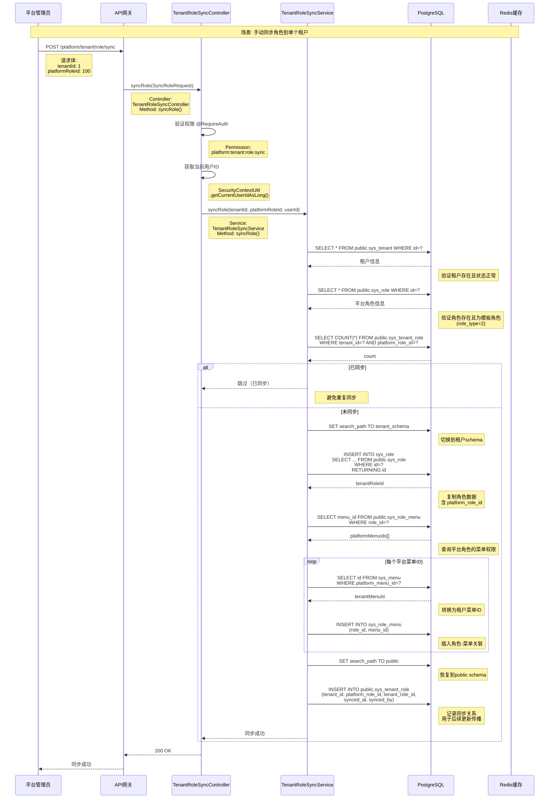
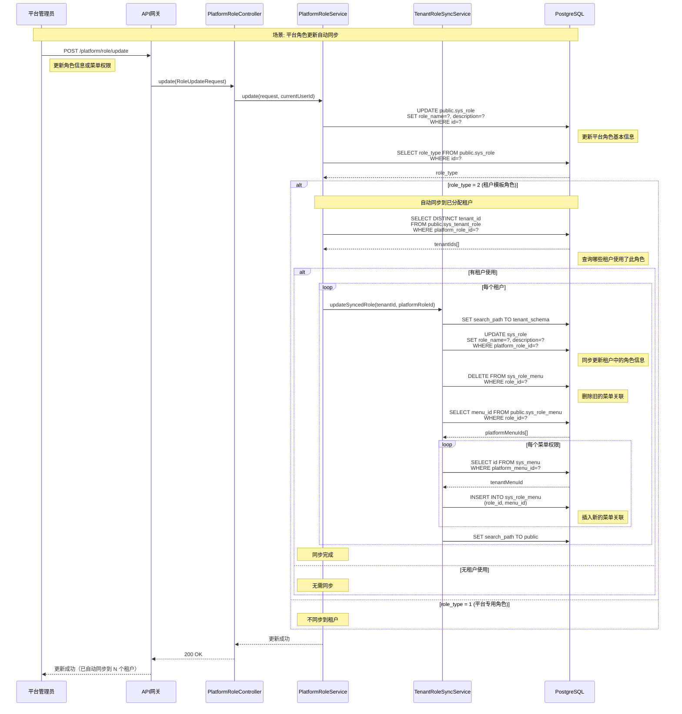

# 平台角色同步到租户完整流程时序图

**文档版本**: v1.0
**创建日期**: 2025-10-18
**适用架构**: 平台角色管理架构 v3.0

---

## 📋 流程概述

本文档详细记录平台角色同步到租户的完整流程,包括手动同步、批量同步、全量同步和更新同步等场景。

### 核心流程

```
平台创建角色 → 配置菜单权限 → 手动同步到租户 → 租户使用角色（只读）
                              ↓
                        平台更新角色 → 自动同步到已分配租户
```

### 关键特性

- ✅ **多种同步方式**: 单个同步、批量同步、全量同步
- ✅ **自动级联同步**: 角色-菜单关联关系自动同步
- ✅ **只读保护**: 租户无法修改/删除平台同步的角色
- ✅ **更新传播**: 平台角色更新自动同步到已分配租户
- ✅ **Feature Level筛选**: 根据租户版本自动筛选角色模板

---

## 🔄 场景1: 手动同步角色到单个租户

### 1.1 完整时序图



---

### 1.2 详细步骤说明

#### 1.2.1 API请求

**接口**: `POST /platform/tenant/role/sync`

**请求示例**:
```bash
POST http://localhost:8080/platform/tenant/role/sync
Content-Type: application/json
Authorization: Bearer <platform_admin_token>

{
  "tenantId": 1,
  "platformRoleId": 100
}
```

**权限要求**: `platform:tenant:role:sync`

#### 1.2.2 Controller层

**文件**: `com.seer.fitness.system.controller.TenantRoleSyncController`
**方法**: `syncRole(SyncRoleRequest request)`
**位置**: `TenantRoleSyncController.java:50-61`

**代码片段**:
```java
@PostMapping("/sync")
@RequireAuth(permissions = {"platform:tenant:role:sync"})
@OperationLog(
    type = OperationType.SYNC,
    module = "tenant_role_sync",
    description = "同步平台角色到租户"
)
public MyResponseResult<Void> syncRole(@RequestBody SyncRoleRequest request) {
    Long currentUserId = SecurityContextUtil.getCurrentUserIdAsLong();
    tenantRoleSyncService.syncRole(request.getTenantId(), request.getPlatformRoleId(), currentUserId);
    return super.doJsonDefaultMsg();
}
```

#### 1.2.3 Service层 - 核心同步逻辑

**文件**: `com.seer.fitness.system.service.TenantRoleSyncService`
**方法**: `syncRole(Long tenantId, Long platformRoleId, Long currentUserId)`
**位置**: `TenantRoleSyncService.java:80-200`

**完整流程**:

```java
@Transactional(readOnly = false)
@PublicSchema(reason = "需要查询平台角色并同步到租户schema")
public void syncRole(Long tenantId, Long platformRoleId, Long currentUserId) {
    log.info("开始同步角色: tenantId={}, platformRoleId={}", tenantId, platformRoleId);

    // 1. 验证租户
    SysTenant tenant = validateTenant(tenantId);

    // 2. 验证平台角色
    SysRole platformRole = validatePlatformRole(platformRoleId);

    // 3. 检查是否已同步
    if (isRoleSynced(tenantId, platformRoleId)) {
        log.warn("角色已同步，跳过: tenantId={}, platformRoleId={}", tenantId, platformRoleId);
        return;
    }

    // 4. 复制角色到租户schema
    Long tenantRoleId = copyRoleToTenantSchema(tenant.getSchemaName(), platformRole, currentUserId);

    // 5. 同步角色-菜单关联关系
    syncRoleMenuAssociations(tenant.getSchemaName(), platformRoleId, tenantRoleId);

    // 6. 记录同步关系
    recordSyncRelation(tenantId, platformRoleId, tenantRoleId, currentUserId);

    log.info("角色同步成功: tenantId={}, platformRoleId={}, tenantRoleId={}",
             tenantId, platformRoleId, tenantRoleId);
}
```

**关键方法详解**:

##### 1. 验证租户
```java
private SysTenant validateTenant(Long tenantId) {
    String sql = "SELECT * FROM sys_tenant WHERE id = :tenantId AND delete_flag = 0";
    Map<String, Object> params = Maps.newHashMap();
    params.put("tenantId", tenantId);

    SysTenant tenant = baseDao.querySingleForSqlWithDeleteCondition(sql, params, SysTenant.class);
    if (tenant == null) {
        throw new BusinessException("租户不存在或已删除");
    }

    if (tenant.getStatus() != 1) {
        throw new BusinessException("租户状态异常，无法同步角色");
    }

    return tenant;
}
```

**SQL**:
```sql
SELECT id, tenant_code, tenant_name, schema_name, status
FROM public.sys_tenant
WHERE id = 1 AND delete_flag = 0;
```

##### 2. 验证平台角色
```java
private SysRole validatePlatformRole(Long platformRoleId) {
    String sql = "SELECT * FROM sys_role WHERE id = :roleId AND delete_flag = 0";
    Map<String, Object> params = Maps.newHashMap();
    params.put("roleId", platformRoleId);

    SysRole role = baseDao.querySingleForSqlWithDeleteCondition(sql, params, SysRole.class);
    if (role == null) {
        throw new BusinessException("平台角色不存在或已删除");
    }

    if (role.getRoleType() != 2) {
        throw new BusinessException("只能同步租户模板角色(role_type=2)");
    }

    return role;
}
```

**SQL**:
```sql
SELECT id, role_name, description, role_type, feature_level, status
FROM public.sys_role
WHERE id = 100 AND delete_flag = 0;
```

##### 3. 检查是否已同步
```java
private boolean isRoleSynced(Long tenantId, Long platformRoleId) {
    String sql = "SELECT COUNT(*) FROM sys_tenant_role " +
                 "WHERE tenant_id = :tenantId AND platform_role_id = :platformRoleId";
    Map<String, Object> params = Maps.newHashMap();
    params.put("tenantId", tenantId);
    params.put("platformRoleId", platformRoleId);

    Long count = baseDao.querySingleForSqlWithDeleteCondition(sql, params, Long.class);
    return count != null && count > 0;
}
```

**SQL**:
```sql
SELECT COUNT(*) FROM public.sys_tenant_role
WHERE tenant_id = 1 AND platform_role_id = 100;
```

##### 4. 复制角色到租户schema
```java
private Long copyRoleToTenantSchema(String schemaName, SysRole platformRole, Long currentUserId) {
    // 切换到租户schema
    setSearchPath(schemaName);

    // 复制角色数据
    String sql = "INSERT INTO sys_role (" +
                 "id, role_name, description, role_type, feature_level, status, " +
                 "delete_flag, platform_role_id, created_at, updated_at, created_by" +
                 ") VALUES (" +
                 "nextval('sys_role_id_seq'), :roleName, :description, :roleType, :featureLevel, :status, " +
                 "0, :platformRoleId, NOW(), NOW(), :createdBy" +
                 ") RETURNING id";

    Map<String, Object> params = Maps.newHashMap();
    params.put("roleName", platformRole.getRoleName());
    params.put("description", platformRole.getDescription());
    params.put("roleType", platformRole.getRoleType());
    params.put("featureLevel", platformRole.getFeatureLevel());
    params.put("status", platformRole.getStatus());
    params.put("platformRoleId", platformRole.getId());
    params.put("createdBy", currentUserId);

    Long tenantRoleId = baseDao.querySingleForSqlWithDeleteCondition(sql, params, Long.class);

    // 恢复到public schema
    resetSearchPath();

    return tenantRoleId;
}
```

**SQL**:
```sql
-- 切换schema
SET search_path TO tenant_001;

-- 插入角色
INSERT INTO sys_role (
    id, role_name, description, role_type, feature_level, status,
    delete_flag, platform_role_id, created_at, updated_at, created_by
) VALUES (
    nextval('sys_role_id_seq'),
    '普通用户',
    '系统普通用户角色',
    2,           -- role_type: 租户模板角色
    1,           -- feature_level: 基础版
    1,           -- status: 启用
    0,           -- delete_flag: 未删除
    100,         -- platform_role_id: 平台角色ID（标记为平台同步，只读）
    NOW(),
    NOW(),
    1
) RETURNING id;

-- 假设返回: id = 50

-- 恢复schema
SET search_path TO public;
```

##### 5. 同步角色-菜单关联关系
```java
private void syncRoleMenuAssociations(String schemaName, Long platformRoleId, Long tenantRoleId) {
    // 1. 查询平台角色的菜单权限
    String querySql = "SELECT menu_id FROM sys_role_menu WHERE role_id = :roleId";
    Map<String, Object> queryParams = Maps.newHashMap();
    queryParams.put("roleId", platformRoleId);

    List<Long> platformMenuIds = baseDao.querySqlForList(querySql, queryParams, Long.class);

    if (platformMenuIds.isEmpty()) {
        log.warn("平台角色没有配置菜单权限: platformRoleId={}", platformRoleId);
        return;
    }

    log.info("找到 {} 个菜单权限待同步", platformMenuIds.size());

    // 2. 切换到租户schema
    setSearchPath(schemaName);

    // 3. 转换平台菜单ID为租户菜单ID并插入关联
    int successCount = 0;
    for (Long platformMenuId : platformMenuIds) {
        try {
            // 查询对应的租户菜单ID
            String findMenuSql = "SELECT id FROM sys_menu WHERE platform_menu_id = :platformMenuId";
            Map<String, Object> findParams = Maps.newHashMap();
            findParams.put("platformMenuId", platformMenuId);

            Long tenantMenuId = baseDao.querySingleForSqlWithDeleteCondition(findMenuSql, findParams, Long.class);

            if (tenantMenuId == null) {
                log.warn("租户中未找到对应菜单: platformMenuId={}", platformMenuId);
                continue;
            }

            // 插入角色-菜单关联
            String insertSql = "INSERT INTO sys_role_menu (id, role_id, menu_id, created_at) " +
                              "VALUES (nextval('sys_role_menu_id_seq'), :roleId, :menuId, NOW())";
            Map<String, Object> insertParams = Maps.newHashMap();
            insertParams.put("roleId", tenantRoleId);
            insertParams.put("menuId", tenantMenuId);

            baseDao.executeSql(insertSql, insertParams);
            successCount++;

        } catch (Exception e) {
            log.warn("菜单关联同步失败: platformMenuId={}, error={}", platformMenuId, e.getMessage());
        }
    }

    // 4. 恢复到public schema
    resetSearchPath();

    log.info("角色-菜单关联同步完成: total={}, success={}", platformMenuIds.size(), successCount);
}
```

**SQL**:
```sql
-- 1. 查询平台角色的菜单权限
SELECT menu_id FROM public.sys_role_menu
WHERE role_id = 100;

-- 假设返回: [2001000, 2001001, 2001002, 2002000, 2002001]

-- 2. 切换到租户schema
SET search_path TO tenant_001;

-- 3. 转换平台菜单ID为租户菜单ID
SELECT id FROM sys_menu WHERE platform_menu_id = 2001000;  -- 返回: 10
SELECT id FROM sys_menu WHERE platform_menu_id = 2001001;  -- 返回: 11
SELECT id FROM sys_menu WHERE platform_menu_id = 2001002;  -- 返回: 12
SELECT id FROM sys_menu WHERE platform_menu_id = 2002000;  -- 返回: 20
SELECT id FROM sys_menu WHERE platform_menu_id = 2002001;  -- 返回: 21

-- 4. 插入角色-菜单关联
INSERT INTO sys_role_menu (id, role_id, menu_id, created_at)
VALUES
    (nextval('sys_role_menu_id_seq'), 50, 10, NOW()),
    (nextval('sys_role_menu_id_seq'), 50, 11, NOW()),
    (nextval('sys_role_menu_id_seq'), 50, 12, NOW()),
    (nextval('sys_role_menu_id_seq'), 50, 20, NOW()),
    (nextval('sys_role_menu_id_seq'), 50, 21, NOW());

-- 5. 恢复schema
SET search_path TO public;
```

##### 6. 记录同步关系
```java
private void recordSyncRelation(Long tenantId, Long platformRoleId, Long tenantRoleId, Long currentUserId) {
    String sql = "INSERT INTO sys_tenant_role (" +
                 "id, tenant_id, platform_role_id, tenant_role_id, synced_at, synced_by" +
                 ") VALUES (" +
                 "nextval('sys_tenant_role_id_seq'), :tenantId, :platformRoleId, :tenantRoleId, NOW(), :syncedBy" +
                 ")";

    Map<String, Object> params = Maps.newHashMap();
    params.put("tenantId", tenantId);
    params.put("platformRoleId", platformRoleId);
    params.put("tenantRoleId", tenantRoleId);
    params.put("syncedBy", currentUserId);

    baseDao.executeSql(sql, params);
}
```

**SQL**:
```sql
INSERT INTO public.sys_tenant_role (
    id, tenant_id, platform_role_id, tenant_role_id, synced_at, synced_by
) VALUES (
    nextval('sys_tenant_role_id_seq'),
    1,              -- tenantId
    100,            -- platformRoleId
    50,             -- tenantRoleId (租户schema中的角色ID)
    NOW(),
    1               -- currentUserId
);
```

---

## 🔄 场景2: 批量同步角色到多个租户

### 2.1 API请求

**接口**: `POST /platform/tenant/role/sync/batch`

**请求示例**:
```bash
POST http://localhost:8080/platform/tenant/role/sync/batch
Content-Type: application/json
Authorization: Bearer <platform_admin_token>

{
  "tenantIds": [1, 2, 3],
  "platformRoleIds": [100, 101, 102]
}
```

**说明**:
- 支持 N 个租户 × M 个角色的笛卡尔积同步
- 示例: 3个租户 × 3个角色 = 9次同步操作

### 2.2 Controller层

**代码片段**:
```java
@PostMapping("/sync/batch")
@RequireAuth(permissions = {"platform:tenant:role:sync"})
@OperationLog(
    type = OperationType.SYNC,
    module = "tenant_role_sync",
    description = "批量同步平台角色到租户"
)
public MyResponseResult<Map<String, Object>> syncRoleBatch(@RequestBody SyncRoleBatchRequest request) {
    Long currentUserId = SecurityContextUtil.getCurrentUserIdAsLong();
    int successCount = tenantRoleSyncService.syncRoles(
        request.getTenantIds(),
        request.getPlatformRoleIds(),
        currentUserId
    );

    Map<String, Object> result = new HashMap<>();
    result.put("totalTenants", request.getTenantIds().size());
    result.put("totalRoles", request.getPlatformRoleIds().size());
    result.put("successCount", successCount);
    result.put("expectedCount", request.getTenantIds().size() * request.getPlatformRoleIds().size());

    return super.doJsonOut(result);
}
```

### 2.3 Service层

```java
@Transactional(readOnly = false)
@PublicSchema(reason = "批量同步角色到多个租户")
public int syncRoles(List<Long> tenantIds, List<Long> platformRoleIds, Long currentUserId) {
    int successCount = 0;

    for (Long tenantId : tenantIds) {
        for (Long platformRoleId : platformRoleIds) {
            try {
                syncRole(tenantId, platformRoleId, currentUserId);
                successCount++;
            } catch (Exception e) {
                log.warn("角色同步失败: tenantId={}, platformRoleId={}, error={}",
                         tenantId, platformRoleId, e.getMessage());
                // 继续处理下一个
            }
        }
    }

    log.info("批量同步完成: tenants={}, roles={}, success={}",
             tenantIds.size(), platformRoleIds.size(), successCount);

    return successCount;
}
```

**响应示例**:
```json
{
  "code": 200,
  "data": {
    "totalTenants": 3,
    "totalRoles": 3,
    "successCount": 9,
    "expectedCount": 9
  }
}
```

---

## 🔄 场景3: 同步角色到所有租户

### 3.1 API请求

**接口**: `POST /platform/tenant/role/sync/all`

**请求示例**:
```bash
POST http://localhost:8080/platform/tenant/role/sync/all
Content-Type: application/json
Authorization: Bearer <platform_admin_token>

{
  "platformRoleIds": [100, 101]
}
```

**说明**:
- 查询所有状态正常的租户
- 将指定角色同步到所有租户
- 适用场景: 新增通用角色模板，需要推送到所有现有租户

### 3.2 Service层

```java
@Transactional(readOnly = false)
@PublicSchema(reason = "同步角色到所有租户")
public int syncRoleToAllTenants(Long platformRoleId, Long currentUserId) {
    // 1. 查询所有正常状态的租户
    String sql = "SELECT id FROM sys_tenant WHERE status = 1 AND delete_flag = 0";
    List<Long> tenantIds = baseDao.querySqlForList(sql, Maps.newHashMap(), Long.class);

    if (tenantIds.isEmpty()) {
        log.warn("没有找到可用的租户");
        return 0;
    }

    log.info("找到 {} 个租户待同步角色: platformRoleId={}", tenantIds.size(), platformRoleId);

    // 2. 循环同步到每个租户
    int successCount = 0;
    for (Long tenantId : tenantIds) {
        try {
            syncRole(tenantId, platformRoleId, currentUserId);
            successCount++;
        } catch (Exception e) {
            log.warn("角色同步失败: tenantId={}, platformRoleId={}, error={}",
                     tenantId, platformRoleId, e.getMessage());
        }
    }

    log.info("全量同步完成: platformRoleId={}, total={}, success={}",
             platformRoleId, tenantIds.size(), successCount);

    return successCount;
}
```

**SQL**:
```sql
-- 查询所有正常状态的租户
SELECT id FROM public.sys_tenant
WHERE status = 1 AND delete_flag = 0;

-- 假设返回: [1, 2, 3, 4, 5]

-- 然后依次调用 syncRole() 同步到每个租户
```

---

## 🔄 场景4: 平台角色更新自动同步

### 4.1 更新触发时机

平台角色更新时,自动同步到所有已分配的租户:

**触发条件**:
1. 平台角色基本信息更新 (角色名、描述等)
2. 平台角色权限配置更新 (菜单权限变更)
3. 仅同步 `role_type=2` 的租户模板角色

### 4.2 完整时序图



### 4.3 Service层 - 更新同步逻辑

**文件**: `com.seer.fitness.system.service.PlatformRoleService`
**方法**: `update(RoleUpdateRequest request, Long currentUserId)`

```java
@Transactional(readOnly = false)
@PublicSchema(reason = "更新平台角色")
public void update(RoleUpdateRequest request, Long currentUserId) {
    Long roleId = request.getId();

    // 1. 验证角色存在
    SysRole role = getById(roleId);
    if (role == null) {
        throw new BusinessException("角色不存在");
    }

    // 2. 更新平台角色基本信息
    role.setRoleName(request.getRoleName());
    role.setDescription(request.getDescription());
    role.setStatus(request.getStatus());
    role.setUpdatedAt(LocalDateTime.now());
    role.setUpdatedBy(currentUserId);

    baseDao.updatePO(role);

    log.info("平台角色更新成功: roleId={}, roleName={}", roleId, request.getRoleName());

    // 3. 如果是租户模板角色，自动同步到已分配租户
    if (role.getRoleType() == 2) {
        autoSyncToAssignedTenants(roleId, currentUserId);
    }
}
```

**自动同步方法**:
```java
private void autoSyncToAssignedTenants(Long platformRoleId, Long currentUserId) {
    // 1. 查询已分配的租户
    String sql = "SELECT DISTINCT tenant_id FROM sys_tenant_role " +
                 "WHERE platform_role_id = :platformRoleId";
    Map<String, Object> params = Maps.newHashMap();
    params.put("platformRoleId", platformRoleId);

    List<Long> tenantIds = baseDao.querySqlForList(sql, params, Long.class);

    if (tenantIds.isEmpty()) {
        log.info("角色未分配给任何租户，无需同步: platformRoleId={}", platformRoleId);
        return;
    }

    log.info("开始同步角色更新到 {} 个租户: platformRoleId={}", tenantIds.size(), platformRoleId);

    // 2. 同步到每个租户
    int successCount = 0;
    for (Long tenantId : tenantIds) {
        try {
            tenantRoleSyncService.updateSyncedRole(tenantId, platformRoleId, currentUserId);
            successCount++;
        } catch (Exception e) {
            log.error("角色更新同步失败: tenantId={}, platformRoleId={}, error={}",
                     tenantId, platformRoleId, e.getMessage());
        }
    }

    log.info("角色更新同步完成: platformRoleId={}, total={}, success={}",
             platformRoleId, tenantIds.size(), successCount);
}
```

**更新已同步角色方法**:
```java
// TenantRoleSyncService.updateSyncedRole()

@Transactional(readOnly = false)
public void updateSyncedRole(Long tenantId, Long platformRoleId, Long currentUserId) {
    // 1. 获取租户信息
    SysTenant tenant = getTenant(tenantId);

    // 2. 获取平台角色最新信息
    SysRole platformRole = getPlatformRole(platformRoleId);

    // 3. 获取租户角色ID
    Long tenantRoleId = getTenantRoleId(tenantId, platformRoleId);
    if (tenantRoleId == null) {
        log.warn("租户中未找到同步的角色: tenantId={}, platformRoleId={}", tenantId, platformRoleId);
        return;
    }

    // 4. 切换到租户schema
    setSearchPath(tenant.getSchemaName());

    // 5. 更新租户角色基本信息
    String updateSql = "UPDATE sys_role " +
                      "SET role_name = :roleName, description = :description, " +
                      "status = :status, updated_at = NOW(), updated_by = :updatedBy " +
                      "WHERE id = :roleId";

    Map<String, Object> updateParams = Maps.newHashMap();
    updateParams.put("roleName", platformRole.getRoleName());
    updateParams.put("description", platformRole.getDescription());
    updateParams.put("status", platformRole.getStatus());
    updateParams.put("updatedBy", currentUserId);
    updateParams.put("roleId", tenantRoleId);

    baseDao.executeSql(updateSql, updateParams);

    // 6. 重新同步菜单权限
    resyncRoleMenuAssociations(platformRoleId, tenantRoleId);

    // 7. 恢复schema
    resetSearchPath();

    log.info("租户角色更新成功: tenantId={}, tenantRoleId={}", tenantId, tenantRoleId);
}
```

**重新同步菜单权限**:
```java
private void resyncRoleMenuAssociations(Long platformRoleId, Long tenantRoleId) {
    // 1. 删除旧的菜单关联
    String deleteSql = "DELETE FROM sys_role_menu WHERE role_id = :roleId";
    Map<String, Object> deleteParams = Maps.newHashMap();
    deleteParams.put("roleId", tenantRoleId);
    baseDao.executeSql(deleteSql, deleteParams);

    // 2. 查询平台角色的最新菜单权限
    String querySql = "SELECT menu_id FROM public.sys_role_menu WHERE role_id = :roleId";
    Map<String, Object> queryParams = Maps.newHashMap();
    queryParams.put("roleId", platformRoleId);
    List<Long> platformMenuIds = baseDao.querySqlForList(querySql, queryParams, Long.class);

    // 3. 插入新的菜单关联
    for (Long platformMenuId : platformMenuIds) {
        // 转换为租户菜单ID
        String findMenuSql = "SELECT id FROM sys_menu WHERE platform_menu_id = :platformMenuId";
        Map<String, Object> findParams = Maps.newHashMap();
        findParams.put("platformMenuId", platformMenuId);
        Long tenantMenuId = baseDao.querySingleForSqlWithDeleteCondition(findMenuSql, findParams, Long.class);

        if (tenantMenuId != null) {
            String insertSql = "INSERT INTO sys_role_menu (id, role_id, menu_id, created_at) " +
                              "VALUES (nextval('sys_role_menu_id_seq'), :roleId, :menuId, NOW())";
            Map<String, Object> insertParams = Maps.newHashMap();
            insertParams.put("roleId", tenantRoleId);
            insertParams.put("menuId", tenantMenuId);
            baseDao.executeSql(insertSql, insertParams);
        }
    }

    log.info("角色菜单权限重新同步完成: tenantRoleId={}, menuCount={}", tenantRoleId, platformMenuIds.size());
}
```

**SQL示例**:
```sql
-- 1. 查询已分配的租户
SELECT DISTINCT tenant_id
FROM public.sys_tenant_role
WHERE platform_role_id = 100;

-- 假设返回: [1, 2, 3]

-- 对每个租户执行以下操作:

-- 2. 切换到租户schema
SET search_path TO tenant_001;

-- 3. 更新租户角色基本信息
UPDATE sys_role
SET role_name = '普通用户(已更新)',
    description = '系统普通用户角色(更新后)',
    status = 1,
    updated_at = NOW(),
    updated_by = 1
WHERE platform_role_id = 100;

-- 4. 删除旧的菜单关联
DELETE FROM sys_role_menu WHERE role_id = 50;

-- 5. 查询平台角色的最新菜单权限
SELECT menu_id FROM public.sys_role_menu WHERE role_id = 100;

-- 假设返回: [2001000, 2001001, 2001003, 2002000]  (注意: 2001002被删除, 2001003是新增)

-- 6. 转换并插入新的菜单关联
SELECT id FROM sys_menu WHERE platform_menu_id = 2001000;  -- 返回: 10
SELECT id FROM sys_menu WHERE platform_menu_id = 2001001;  -- 返回: 11
SELECT id FROM sys_menu WHERE platform_menu_id = 2001003;  -- 返回: 13
SELECT id FROM sys_menu WHERE platform_menu_id = 2002000;  -- 返回: 20

INSERT INTO sys_role_menu (id, role_id, menu_id, created_at)
VALUES
    (nextval('sys_role_menu_id_seq'), 50, 10, NOW()),
    (nextval('sys_role_menu_id_seq'), 50, 11, NOW()),
    (nextval('sys_role_menu_id_seq'), 50, 13, NOW()),
    (nextval('sys_role_menu_id_seq'), 50, 20, NOW());

-- 7. 恢复schema
SET search_path TO public;
```

---

## 🔒 租户侧只读保护

### 5.1 保护机制

租户侧的角色管理通过 `platform_role_id` 字段识别平台同步的角色,并在 Service 层阻止修改/删除操作。

### 5.2 Service层保护

**文件**: `com.seer.fitness.system.service.RoleService` (租户侧)
**方法**: `update()`, `delete()`

**更新保护**:
```java
@Transactional(readOnly = false)
public void update(RoleUpdateRequest request) {
    // 检查是否为平台同步的角色
    if (isPlatformSyncedRole(request.getId())) {
        throw new BusinessException("平台同步的角色不能修改，请联系平台管理员");
    }

    // 正常更新逻辑
    // ...
}

private boolean isPlatformSyncedRole(Long roleId) {
    String sql = "SELECT platform_role_id FROM sys_role WHERE id = :roleId";
    Map<String, Object> params = Maps.newHashMap();
    params.put("roleId", roleId);
    Long platformRoleId = baseDao.querySingleForSqlWithDeleteCondition(sql, params, Long.class);
    return platformRoleId != null;
}
```

**删除保护**:
```java
@Transactional(readOnly = false)
public void delete(String... ids) {
    for (String id : ids) {
        Long roleId = Long.valueOf(id);

        // 检查是否为平台同步的角色
        if (isPlatformSyncedRole(roleId)) {
            throw new BusinessException("平台同步的角色不能删除，请联系平台管理员");
        }

        // 正常删除逻辑（软删除）
        // ...
    }
}
```

**SQL**:
```sql
-- 检查角色是否为平台同步
SELECT platform_role_id FROM sys_role WHERE id = 50;

-- 如果返回非NULL值（如 100），则表示该角色由平台同步而来，不允许修改/删除
```

---

## 📊 数据库变更记录

### Public Schema

**表: sys_tenant_role** (新增)
```sql
CREATE TABLE public.sys_tenant_role (
    id BIGSERIAL PRIMARY KEY,
    tenant_id BIGINT NOT NULL,           -- 租户ID
    platform_role_id BIGINT NOT NULL,    -- 平台角色ID
    tenant_role_id BIGINT NOT NULL,      -- 租户schema中的角色ID
    synced_at TIMESTAMP NOT NULL,        -- 同步时间
    synced_by BIGINT,                    -- 同步人
    UNIQUE(tenant_id, platform_role_id)  -- 防止重复同步
);

-- 索引
CREATE INDEX idx_tenant_role_tenant ON public.sys_tenant_role(tenant_id);
CREATE INDEX idx_tenant_role_platform ON public.sys_tenant_role(platform_role_id);
```

**示例数据**:
```sql
INSERT INTO public.sys_tenant_role (tenant_id, platform_role_id, tenant_role_id, synced_at, synced_by)
VALUES
    (1, 100, 50, NOW(), 1),  -- 租户1同步了角色100，在租户schema中ID为50
    (1, 101, 51, NOW(), 1),  -- 租户1同步了角色101，在租户schema中ID为51
    (2, 100, 60, NOW(), 1),  -- 租户2同步了角色100，在租户schema中ID为60
    (3, 100, 70, NOW(), 1);  -- 租户3同步了角色100，在租户schema中ID为70
```

### Tenant Schema

**表: sys_role**
```sql
CREATE TABLE sys_role (
    id BIGSERIAL PRIMARY KEY,
    role_name VARCHAR(50) NOT NULL,
    description VARCHAR(255),
    role_type SMALLINT,              -- 角色类型：1-平台专用 2-租户模板
    feature_level SMALLINT,          -- 功能级别：1-基础版 2-标准版 3-企业版
    status SMALLINT DEFAULT 1,
    delete_flag SMALLINT DEFAULT 0,
    platform_role_id BIGINT,         -- 平台角色ID（标记为平台同步的角色，只读）
    created_at TIMESTAMP,
    updated_at TIMESTAMP,
    created_by BIGINT,
    updated_by BIGINT
);

-- 索引
CREATE INDEX idx_role_platform ON sys_role(platform_role_id);
```

**示例数据**:
```sql
-- 租户schema: tenant_001
INSERT INTO sys_role (id, role_name, description, role_type, feature_level, status, platform_role_id, created_at, created_by)
VALUES
    (50, '普通用户', '系统普通用户角色', 2, 1, 1, 100, NOW(), 1),  -- 平台同步，只读
    (51, '部门主管', '部门主管角色', 2, 2, 1, 101, NOW(), 1),      -- 平台同步，只读
    (52, '自定义角色', '租户自建角色', NULL, NULL, 1, NULL, NOW(), 1);  -- 租户创建，可编辑
```

---

## ⚠️ 错误处理

### 常见错误

#### 1. 租户不存在或状态异常
```json
{
  "code": 500,
  "message": "租户不存在或已删除"
}
```

#### 2. 平台角色不是模板角色
```json
{
  "code": 500,
  "message": "只能同步租户模板角色(role_type=2)"
}
```

#### 3. 角色已同步（重复同步）
**行为**: 跳过，记录warn日志，不抛出异常

#### 4. 租户中缺少对应菜单
**行为**: 跳过该菜单权限，继续同步其他权限，记录warn日志

#### 5. 租户尝试修改平台同步的角色
```json
{
  "code": 500,
  "message": "平台同步的角色不能修改，请联系平台管理员"
}
```

---

## ✅ 测试验证点

### 1. 单个同步验证
```sql
-- 验证同步关系记录
SELECT * FROM public.sys_tenant_role
WHERE tenant_id = 1 AND platform_role_id = 100;

-- 验证租户角色已创建
SELECT * FROM tenant_001.sys_role WHERE platform_role_id = 100;

-- 验证角色-菜单关联已同步
SELECT COUNT(*) FROM tenant_001.sys_role_menu
WHERE role_id = (SELECT id FROM tenant_001.sys_role WHERE platform_role_id = 100);
```

### 2. 批量同步验证
```sql
-- 验证同步数量
SELECT COUNT(*) FROM public.sys_tenant_role
WHERE tenant_id IN (1, 2, 3) AND platform_role_id IN (100, 101, 102);

-- 预期: 9条记录 (3租户 × 3角色)
```

### 3. 更新同步验证
```sql
-- 更新平台角色
UPDATE public.sys_role
SET role_name = '普通用户(已更新)', description = '描述已更新'
WHERE id = 100;

-- 验证租户角色已同步更新
SELECT role_name, description
FROM tenant_001.sys_role
WHERE platform_role_id = 100;

-- 预期: role_name = '普通用户(已更新)', description = '描述已更新'
```

### 4. 只读保护验证
```bash
# 租户尝试更新平台同步的角色
curl -X POST http://localhost:8080/system/role/update \
  -H "Authorization: Bearer <tenant_user_token>" \
  -H "Content-Type: application/json" \
  -d '{
    "id": 50,
    "roleName": "修改后的名称"
  }'

# 预期响应: 500错误 "平台同步的角色不能修改，请联系平台管理员"
```

---

## 🔗 相关文档

- [租户创建流程时序图](./租户创建流程时序.md)
- [平台角色管理API文档](../README.md#平台角色管理)
- [系统架构文档](../README.md)

---

**文档版本**: v1.0
**创建日期**: 2025-10-18
**维护人**: Claude AI Assistant
